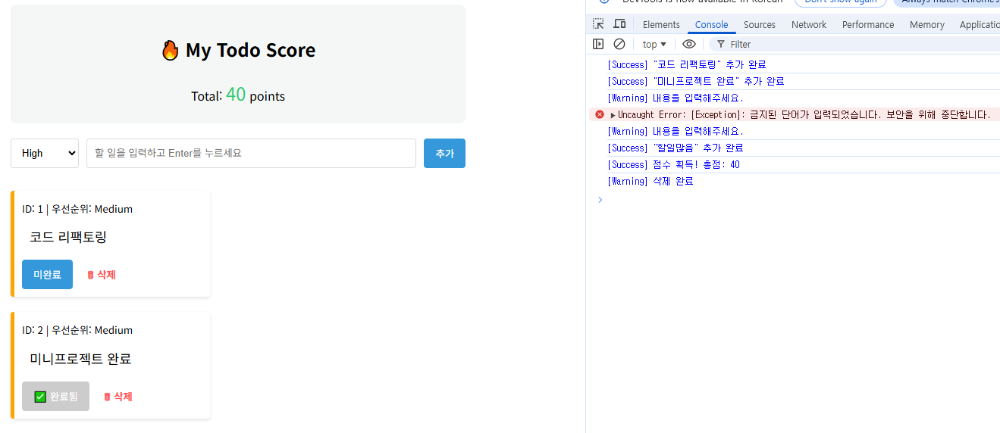
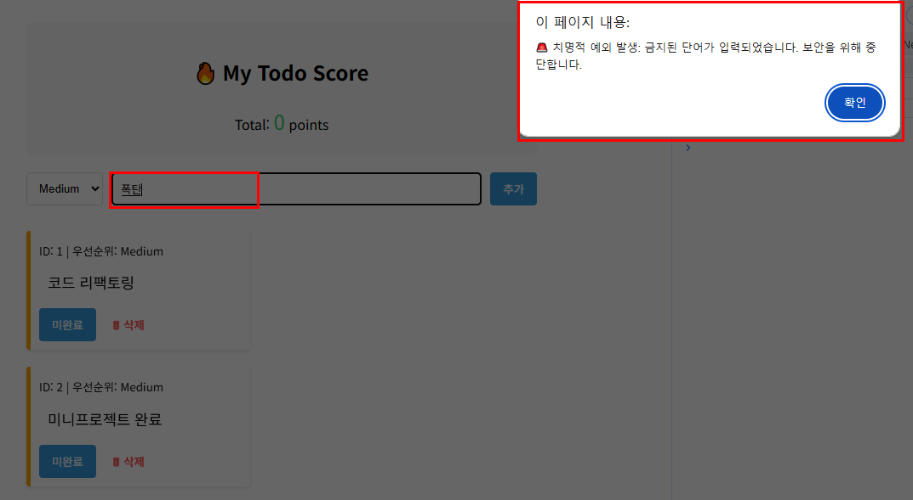

# TypeScript CRUD Mini Project

TypeScript의 인터섹션 타입(Intersection Types)을 활용하여 만든 간단한 할 일 관리(Todo List) 애플리케이션입니다. <br>
VS Code의 인텔리센스(IntelliSense)와 TypeScript 컴파일러를 통해 타입 안정성을 확보하며 개발되었습니다.
TypeScript의 기본 키워드 학습 한후 어떻게 적용되는지 확인합니다.<br>
Type Alias (타입 별칭), Literal Types (리터럴 타입), Intersection Types (인터섹션 타입), Readonly (읽기 전용 속성)<br>
Function Signature (함수 시그니처), void, never, Union Types (유니온 타입)

## ✨ 주요 기능
- **Create**: 메인 입력창에서 할 일 입력 후 `추가` 버튼 클릭 또는 `Enter` 키로 등록
- **Read**: 등록된 할 일을 순번(번호)과 함께 리스트로 조회
- **Update**: 목록의 텍스트를 직접 수정하고 `Enter` 키를 눌러 즉시 반영
- **Delete**: `삭제` 버튼을 통해 항목 제거

## 🛠 사용 기술
- **Language**: TypeScript (Intersection Types: `Identifiable & TaskDetail`)
- **Environment**: Browser (DOM API)
- **Build Tool**: TSC (TypeScript Compiler)

## 📸 실행완료시 점수 추가, 아무것도 입력 안할 때  Warning 등 결과 화면


## 📸 never 결과 화면



---

## 🚀 실행 방법 (Getting Started)

프로젝트를 로컬 환경에서 실행하려면 아래 순서를 따라주세요.

### 1. 사전 준비
Node.js가 설치되어 있어야 하며, 터미널에서 아래 명령어로 TypeScript를 설치합니다.
```bash
npm install typescript
```
### 2. TypeScript 컴파일
```bash
npx tsc
```
### 3. index.html 실행
